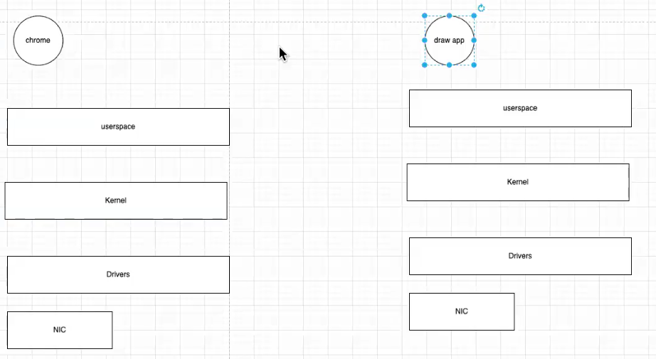
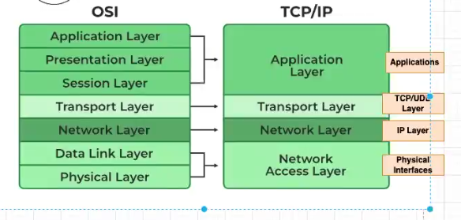
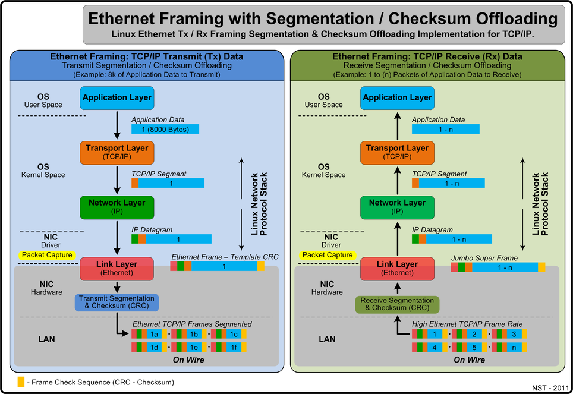
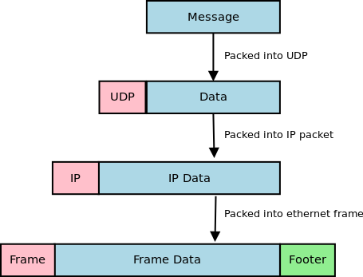

# #Introduction

## Contents
* Bare metal VS Embedded Linux
* Automotive domains
* Embedded Linux requirements 
* General knowledge about Linux architecture.
### Notes:


# #Session1 
* Operating system
	* It is a communication medium between computer HW and user applications.
	* The OS is responsible for managing the HW resources and peripherals connected to it.
* History of Linux
* System calls
* Linux distribution
* Linux kernel
	* It is a free open source program for Linux OS.
	* It is the core component for the Linux OS (like: Ubuntu - Unix - Kali).
	* Linux kernel responsible for managing hardware resources and providing essential services to other software.
	* Linux kernel processes the basic fundamental functions like: (process management, memory management, network subsystem, IPC "Inter process communication" - VFS "virtual file system" ).
	* 
	* Linux kernel
* Linux first rule
* Resources
* Template for study
* 
* 
* Use Linux as user:
* Understand Linux architecture
* Understanding CPU architecture
* Understand Linux Kernal
* Understand kernal components
* 

# #Session2 
* Init process: (system V - system D) we will consider system D, because it is considered as system V upgrade.
* Int process -> user space -> libc (uclibc - glibc) -> system call -> Linux kernel -> drivers.
* work in Egypt: [development cpp application + customization for kernel]
* SYSTEM CALLs:
- comm methode.
- SW interrupt -> call functions (system call)
system call characteristics:
- name
- interrupt number
- stack size
- entry point (function)
- actions (read/write)
process in Linux means ---> running a cpp application

* sys call and their number: https://filippo.io/linux-syscall-table/
* sys call section: (https://www.man7.org/tlpi/)

* USER SPACE (Trace - debug - pref)
- trace: (strace - itrace ), we use "strace" for system call trace (https://medium.com/@chrishantha/linux-performance-observability-tools-19ae2328f87f)
- debug:
- pref: analysis


* tltr tool is used to tell you available options for any Linux command: (https://tldr.inbrowser.app/pages/linux/strace) (sudo apt install tldr)

# #Session5
* **Linux terminal:**
  * It is an application in **User space** layer.
  * We can customize terminal, because and application in user space can be customized.
  * Terminal provides interface (text area) for user, it is connected to **stdin (keyboard) & stdout (display/monitor/text file)**.
  * We need to understand how to use terminal to reduce development time.
  * life-cycle of terminal as a binarry application:
    * open terminal instance
    * write command
    * excute command
    * close terminal
  * What happen when you open a terminal instance?
    * A proccess will be created. (takes CUP time/memory in RAM).
    * Terminal will take a command as input from the user like: (cp - ls - grep - mkdir - ....).
    * Terminal will route to another application that will execute the command, the application is **shell (think of it as scripting languages)** then shell will use **bash (think of it as specific type of scripting language)** to execute the command.
    * Types of shell: (zsh - bash)
    * Example on terminal usage:
      * 1- open new **terminal** [parent process]
      * 2- write command **ls** then press enter.
      * 3- **shell** will be opened and will use (bash or zsh) to execute the **ls** command[child process].
      * 4- **bash** will execute: (bash ls) [child proccess for parent proccess in number 3].
      * 5- return from #4 to #3 then to #1
      * 6- terminal will print the return from #5 using stdout (display/text file).
    * Terminal is connected to shell through (environmemt variable named: `SHELL`).
    * To know which shell (bash or zsh) you are using, run **`echo $SHELL`** you will see one of the following:
      * /bin/bash
      * /bin/zsh
    * commands maybe `shell [implemented in shell (bash, zsh, ...)[(/usr/bin/bash/<command_name>)] ]` specific, or `not shell specific [implemented in root-filesystem: (/usr/bin/<command_name>) ]`. To know, run `which <command name: ls, cp, mkdir,...>` and from the printed path you will know if it is shell specific or not.
      * (Example 1) does `ls` shell specific command?
        * run `which ls` 
        * output: `/usr/bin/ls`, then `ls` not a shell specific command, because it is in root-filesystem commands.
      * (Example 2) does `cd` shell specific command?
        * run `which cd` 
        * output: `nothing`, then `cd` is a shell specific command, because it is not in root-filesystem commands.
    * **Summary**
      * Terminal take commands as input, then run shell agent (bash, zsh, fish, ....).
      * shell agent (bash, zsh, fish, ....): execute command and return output to terminal.
* **Environment variables:**
  * You can look at them as `global variables`.
* **Create alias**
  * Print all aliases:
    * `alias`
  * create new aliases:
    * `alias <alias_name>="<command>"`
    * Then to apply the alias run `source ~/.bashrc`
  * You can pass parameter as input to alias
  * alias not shared between processes
  * How to create an alias?
    * create new hidden file: `vi ~/.bash_git_alias`
    * add your alias in the file: `alias <gst>="<git status>" `
    * add the created file to `~/.bashrc` as follow:
	  ```
	  if [ -f ~/.bash_git_alias ]; then
      . ~/.bash_git_alias
        fi
	  ```
	* apply the changes: `~/.bashrc` or `restart terminal`.
# #Session6
* **Bash script 1:**
  * if command is in root-filesystem ----> will execute in new proccess.
  * if command is in bash -----> will execute in the same proccess.
  * example to know the proccess running:
    * create file: `vi ~/test.sh`
    * write:
      ```
      #! /usr/bin/bash
      sleep 100
      ```
    * change mode: `chmod +x ~/test.sh`
    * run file: `~/test.sh`
    * open new treminal: `pstree`
  * Why we are using `shell:bash` not `python`?
    * because `shell:bash` is the default built in scripting in linux kernal, very light weight, some commands need bash to be executed. Meanwhile python need to be installed.
  * command substitution: `<command substitution>` or: $(<command substitution>), it is used to execute a function and get `result` NOT `return` from command and assign it in variable.
  * function in bash return:
    * status: `return number`
    * result: number or string. 
  * `echo $?` return result of last executed command.
# #Session7
* **Bash script 2:**
  * You can check if a variable already defined before or not.
  * If function is defined twice, the latest one is the one who will be used.
  * **TASK (A)**
    * IPC (inter process communication): Example ($ ls | grep "expression")
    * RPC (remote process communication): Example (network operations, ssh, flashing code)
    * Each verb in requiremtns should be a function.
# #Session8 Network 1
* Goal from any network is to share data between nodes, or between node and server.
* If the machines or nodes are connected over the same network, then it is local area network.
* If the machines or nodes are connected over different network, then it is external area network.
* * Example on external network:
    * 
  * Network architecure:
    * 
  * Network architecture in details:
    * 
  * Ethernet frame:
    * _frame.png)
  * Preparing the frame to be sent:
    * 
* Communication types used in automotive:
  * ` unicast ` : (source -----> one destination).
  * ` Broadcast ` : (source -----> all destinations).
  * ` Multicast ` : (source -----> two or more destinations).
* We can identify any machine with:
  * MAC address, it is a hardcoded code for the NIC (Network interface card) the pythical HW module (wired ethernet card || wireless card). MAC address is 6-bytes leanth.
  * IP address.
* How data is transfered from server (transmitter) to target (receiver)?
  * 1- The server send an ethernet frame with the following information: [Destination MAC address - Source MAC address - Data - CRC ].
  * 2- The target will receive the ethernet fram through its pythical layer [ethernet card], and will verify the destination MAC address, if it is its MAC address then the frame will be cut off from the MAC address (source and destination), and only ` Data and CRC ` will be set to upper layer in the network stack for this targer (network IP layer).
  * 3- The IP layer will check the IP address in the data, if it is matching the machine IP address, then the data will be sent to upper layer "TCP layer".
  * 4- The TCP layer will verify the ` port number => socet number `, and if it is true, data will be sent to ` socket (think of it as an array or data buffer) ` application layer.
  * 5- In application layer, the application that will use the received data will use the a protocol to extract the information. Application protocol like: [http - ssh - SOMEIP (automotive)].
* ` Commands that can be run for network stack `
  * 1- ` NIC (network interface card) ` : we use tool ` ifconfig/ip ` to get information about the NIC "physical layer".
    * - run command ` tldr ifconfig ` to get info about the use of this command.
    * - run command ` ifconfig -a ` to list all NICs.
    * - you can get information like:
      * - Machine MAC addrss
      * - NICs cards
      * - Machine IP
      * - NIC status (UP/Down)
      * - mtu (maximum transmition unit) "in bytes" [maximum size for network frame].
    * - You can (enable/disable) any NIC, using this command: ` sudo ipconfig <NIC_name> UP `
  * 2- 


